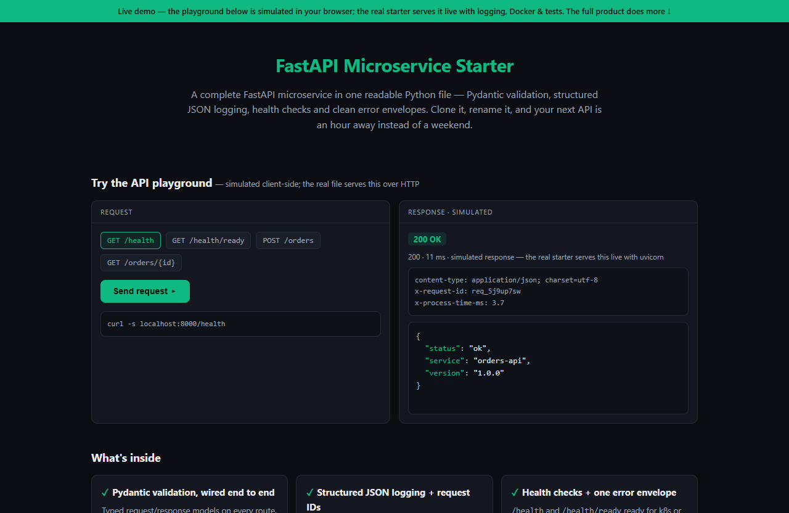

# FastAPI Microservice Starter — live demo

  

  <a href="https://amos-mig.github.io/fastapi-microservice-starter-demo/"><strong>▶ Open the live demo</strong></a> ·
  <a href="https://amosmign.gumroad.com/l/fastapi-microservice-starter"><strong>Get the full product · €29</strong></a>

## What this is

An in-browser API playground that simulates the starter's FastAPI microservice — health-check endpoints, order lookup, and POST /orders with real client-side validation that returns FastAPI-style 422 error envelopes, complete with status codes, headers, request IDs and simulated latency. Locked feature cards and a partial code excerpt tease the full single-file starter's structured logging, Docker/k8s probe config and pytest suite.

**Try it:** Pick POST /orders, set qty to 0 or mangle the JSON, and hit Send — you'll get a realistic 422 envelope with x-request-id headers; or hit GET /orders/99 to see the consistent 404 envelope.

## What you get in the full product

- Pydantic request/response validation wired end to end
- Structured JSON logging with request IDs for easy debugging
- Health-check endpoints ready for k8s or load balancer probes
- Consistent error envelope format across all endpoints
- Single file — readable top to bottom in one sitting

## About

- **Storefront:** [kits.amosmignery.dev](https://kits.amosmignery.dev) — single-file products, instant download, commercial license
- **Checkout:** [Gumroad](https://amosmign.gumroad.com/l/fastapi-microservice-starter) (Merchant of Record, VAT handled)
- **Full product:** [FastAPI Microservice Starter](https://amosmign.gumroad.com/l/fastapi-microservice-starter) · €29

## License

The demo page in this repo is MIT-licensed — reuse the technique, not the product.
The **FastAPI Microservice Starter** itself is not included here and is not free software.
